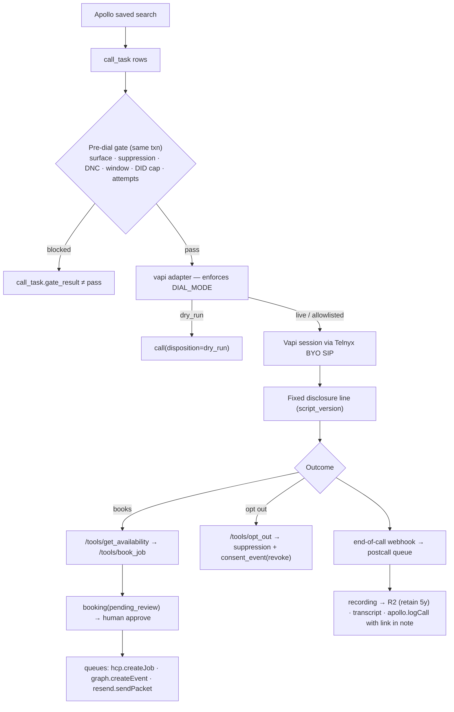

# Architecture — TM Voice

Autonomous outbound voice agent for Transparent Maintenance. Companion to `docs/ERD.md` (schema), `docs/COMPLIANCE.md` (pre-dial rules), `docs/RUNBOOK.md` (accounts, keys, go-live). Settled stack and decisions: build plan 2026-09-08.

## Four layers

| Layer | Component | Where | Status (Phase 0–2) |
|---|---|---|---|
| Front-end | Campaign console (dashboard, review queue, live board) | `apps/console` (Next.js 15) | dashboard read-only; review/live are placeholders (Phases 4/6) |
| Front-end | Self-schedule booking page `/book/[token]` | `apps/console/app/book` | **built** — uses availability service, writes `booking` |
| Middleware | Tool API for the agent (`/tools/*`), booking API, webhooks, health | `apps/api` (Hono) | `opt_out` built; other tools 501 until Phase 4 |
| Middleware | Availability service (materializer + slot query + Redis cache) | `apps/api/src/availability` | **built** |
| Middleware | Dial orchestrator, post-call pipeline, retention sweeper, schedulers | `apps/worker` (BullMQ) | dial.claim in dry_run built; postcall/hcp/graph/resend/apollo are stubs |
| Middleware | Pre-dial gate, suppression, consent ledger, calling windows, disclosure | `packages/compliance` | **built** |
| Middleware | Vendor adapters (apollo, hcp, graph, resend, telnyx, vapi, r2, dnc) | `packages/adapters` | mocks built; real clients built for 7 of 8 — **hcp real client is blocked** (see below) |
| Middleware | Config loader, logger, errors, job envelope | `packages/shared` | **built** |
| Back-end | Postgres schema, migrations, seed | `packages/db` (Drizzle) | **built**, 17 tables |
| Back-end | Redis: BullMQ queues + slot cache | Railway plugin | optional in dry_run |
| Back-end | Cloudflare R2 recordings (5-year retention) | via `r2` adapter | mock |
| Infrastructure | Railway (api, worker, console + Postgres + Redis) | `infra/railway.json`, `apps/*/Dockerfile` | prepared; deploy blocked on `railway login` |
| Infrastructure | Telnyx SIP/DIDs, Vapi orchestration, GitHub Actions CI | `.github/workflows/ci.yml` | CI built |

## Patterns (minimal and repetitive)

| Pattern | Shape | Used by |
|---|---|---|
| Adapter | `{ name, mode, healthcheck() }` + typed methods; zod input; `AdapterError{vendor,code,retryable}`; `withRetry`; mock when key absent or `DIAL_MODE=dry_run` | all 8 vendors |
| Vendor HTTP call | `request()` in `packages/adapters/src/base.ts`: query building, JSON encode/decode, 15s timeout, status → `AdapterError` (408/425/429/5xx and transport errors retryable), wrapped in `withRetry` | every real client except r2, which signs via the S3 SDK |
| Job envelope | `{ entity_id, idempotency_key, attempt, enqueued_at }`; BullMQ `jobId = idempotency_key`; one retry policy; one DLQ (`dead`); `pnpm replay` | every queue |
| Processor registry | `REGISTRY[queue][jobName] → (ctx, payload)` in `apps/worker/src/registry.ts` | every worker job |
| Gate-then-act | `gateAndClaim()` writes `gate_result` in the claiming transaction; only `pass` reaches an adapter | dial orchestrator |
| Materialize + invalidate | pull vendor state into a table on a schedule + webhook; serve from Redis with TTL | schedule_block / slots |
| Token-per-contact public page | `contact.booking_token` → `/book/:token` | booking page |
| Idempotent write | unique `idempotency_key` column + `onConflictDoNothing` | booking, email_send |

Before adding a component or pattern, extend one of these. Two components solving the same problem differently is a finding.

## Features → components → tables owned

| Feature | Components | Owns tables |
|---|---|---|
| Campaign & dial | worker `dial.tick`/`dial.claim`, compliance gate, telnyx/vapi adapters | campaign, call_task, call, did, script_version |
| Compliance | compliance package, dnc adapter, `/tools/opt_out` | consent_event, suppression |
| Availability & booking | api availability service, booking routes, console booking page, hcp adapter | technician, schedule_block, service_address, booking |
| Fulfillment (Phase 4) | worker hcp/graph/resend stubs, review queue | calendar_invite, email_send |
| Post-call (Phase 5) | worker postcall/apollo stubs, r2 adapter | recording, transcript |
| CRM sync | apollo adapter | account, contact |

## Vendor clients

Each adapter selects its mock when `DIAL_MODE=dry_run` or any of its keys is absent, so everything below only runs once real keys are set. None of it has been exercised against a live vendor yet — no account has keys — so the wire shapes come from published specs and docs, and the tests assert the exact request each client builds against a stubbed `fetch`.

| Vendor | Real client | Source of the wire format | Constraint worth knowing |
|---|---|---|---|
| telnyx | `GET /number_lookup/{n}?type=carrier`, `POST /calls`, Ed25519 webhook verify | Telnyx OpenAPI spec | `carrier.type` maps to `landline` **only** for `fixed line`; `fixed line or mobile`, toll free and anything unrecognised become `unknown`, which `landline_only` refuses. `command_id` = call_task id, so a retry cannot double-dial |
| vapi | `POST /call`, `GET /call/{id}`, `GET /phone-number` | Vapi OpenAPI spec | Vapi has **no metadata field** on the call object, and addresses caller ID by `phoneNumberId`, not E.164. The correlation id rides in `name` (40-char cap); the DID is resolved through `/phone-number` and cached per process |
| graph | client-credential token + `POST /users/{mailbox}/events`, `GET …/events/{id}` | Microsoft Learn | `private_key_jwt`: PS256 over `x5t#S256`, so `MS_CLIENT_CERT_PEM` must hold **both** the CERTIFICATE and PRIVATE KEY blocks. Token cached until a minute before expiry. `transactionId` makes create idempotent |
| resend | `POST /emails` | Resend API docs | `Idempotency-Key` dedupes for 24h; capped at 256 chars |
| apollo | `POST /phone_calls`, `PATCH /accounts/{id}`, `POST /contacts/search` | Apollo API docs | All three need a **master** key. Apollo documents `/phone_calls` params as **query string**, not a body, and offers no idempotency header — the job's own key is the only guard. Saved searches are addressed as `contact_label_ids` |
| dnc | `GET /api/v1/check-1/` | DoNotCallDNC developer docs | US-only: a non-`+1` number is refused rather than reported clean, and an inconclusive body raises. The vendor returns **only a federal determination**, so `state` is always false and state-level scrubbing is an open compliance gap |
| r2 | S3 `PutObject` / `GetObject` presign / `DeleteObject` | AWS S3 SDK | The only client not using `request()`; it needs SigV4, so it uses `@aws-sdk/client-s3` (permitted by rule 1 inside `packages/adapters/<vendor>`) pinned to the fetch handler. Presigned URLs cap at 7 days |
| **hcp** | **not implemented** | — | `docs.housecallpro.com` renders client-side and publishes no fetchable OpenAPI document, so the auth scheme (`Bearer` vs `Token`), the `/jobs` scheduled-date filters, the list envelope and pagination, whether an arrival-window endpoint exists, and the webhook signing scheme are all unverified. Rather than put guessed endpoints on the path that materializes availability and writes jobs back, the five methods raise `not_implemented` with that reason. Resolve alongside RUNBOOK §0 check 1 (whether the MAX plan can mint a key at all); the mock keeps availability running meanwhile |

## Call flow

## Runtime topology

- **api** (`PORT` 8787): public `/health`, `/book/:token`, `/tools/*` (Vapi secret), `/webhooks/hcp`; internal (bearer `INTERNAL_API_TOKEN`) `/availability`, `/bookings`, `/campaigns`.
- **worker**: 8 BullMQ queues, concurrency 1 on `dial`; schedulers `availability.materialize` (15 min), `retention.sweep` (daily), `dial.tick` (1 min). Requires `REDIS_URL`.
- **console** (3000): server components call api with the internal token; the booking page is public and token-scoped. No DB access from the console.
- **Local without Docker**: `DATABASE_URL=pglite:./.data/pglite` runs an embedded Postgres; without `REDIS_URL` the api runs its own jobs inline. Tests always use in-memory PGlite.
