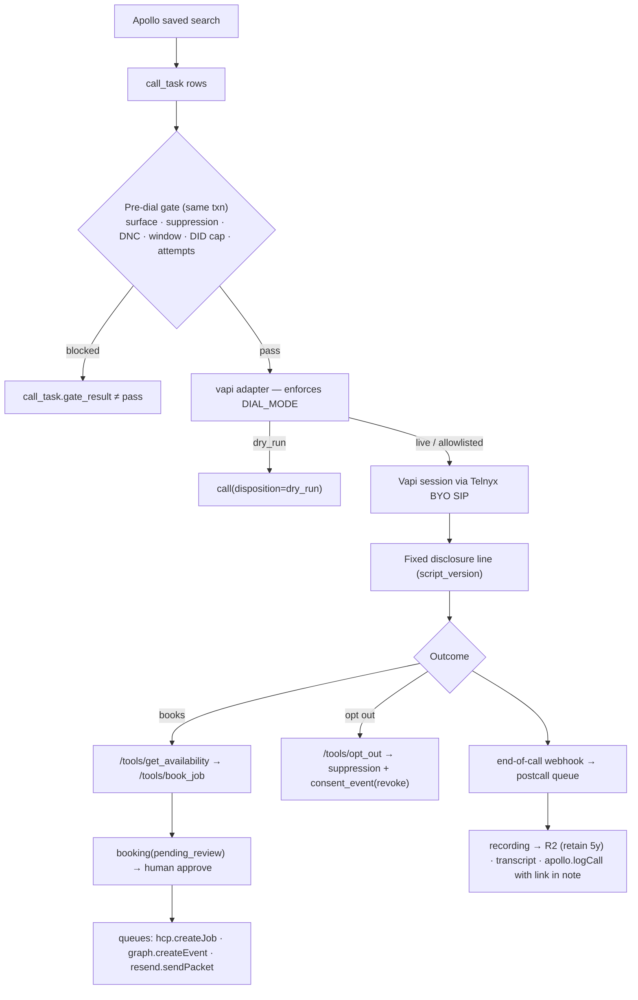

# Architecture — TM Voice

Autonomous outbound voice agent for Transparent Maintenance. Companion to `docs/ERD.md` (schema), `docs/COMPLIANCE.md` (pre-dial rules), `docs/RUNBOOK.md` (accounts, keys, go-live). Settled stack and decisions: build plan 2026-09-08.

## Four layers

| Layer | Component | Where | Status (Phase 0–2) |
|---|---|---|---|
| Front-end | Campaign console (dashboard, review queue, live board) | `apps/console` (Next.js 15) | dashboard read-only; review/live are placeholders (Phases 4/6) |
| Front-end | Self-schedule booking page `/book/[token]` | `apps/console/app/book` | **built** — uses availability service, writes `booking` |
| Middleware | Tool API for the agent (`/tools/*`), booking API, webhooks, health | `apps/api` (Hono) | `opt_out` built; other tools 501 until Phase 4 |
| Middleware | Availability service (materializer + slot query + Redis cache) | `apps/api/src/availability` | **built** |
| Middleware | Dial orchestrator, post-call pipeline, retention sweeper, schedulers | `apps/worker` (BullMQ) | dial.claim in dry_run built; postcall/hcp/graph/resend/apollo are stubs |
| Middleware | Pre-dial gate, suppression, consent ledger, calling windows, disclosure | `packages/compliance` | **built** |
| Middleware | Vendor adapters (apollo, hcp, graph, resend, telnyx, vapi, r2, dnc) | `packages/adapters` | mocks built; real clients Phase 3 |
| Middleware | Config loader, logger, errors, job envelope | `packages/shared` | **built** |
| Back-end | Postgres schema, migrations, seed | `packages/db` (Drizzle) | **built**, 17 tables |
| Back-end | Redis: BullMQ queues + slot cache | Railway plugin | optional in dry_run |
| Back-end | Cloudflare R2 recordings (5-year retention) | via `r2` adapter | mock |
| Infrastructure | Railway (api, worker, console + Postgres + Redis) | `infra/railway.json`, `apps/*/Dockerfile` | prepared; deploy blocked on `railway login` |
| Infrastructure | Telnyx SIP/DIDs, Vapi orchestration, GitHub Actions CI | `.github/workflows/ci.yml` | CI built |

## Patterns (minimal and repetitive)

| Pattern | Shape | Used by |
|---|---|---|
| Adapter | `{ name, mode, healthcheck() }` + typed methods; zod input; `AdapterError{vendor,code,retryable}`; `withRetry`; mock when key absent or `DIAL_MODE=dry_run` | all 8 vendors |
| Job envelope | `{ entity_id, idempotency_key, attempt, enqueued_at }`; BullMQ `jobId = idempotency_key`; one retry policy; one DLQ (`dead`); `pnpm replay` | every queue |
| Processor registry | `REGISTRY[queue][jobName] → (ctx, payload)` in `apps/worker/src/registry.ts` | every worker job |
| Gate-then-act | `gateAndClaim()` writes `gate_result` in the claiming transaction; only `pass` reaches an adapter | dial orchestrator |
| Materialize + invalidate | pull vendor state into a table on a schedule + webhook; serve from Redis with TTL | schedule_block / slots |
| Token-per-contact public page | `contact.booking_token` → `/book/:token` | booking page |
| Idempotent write | unique `idempotency_key` column + `onConflictDoNothing` | booking, email_send |

Before adding a component or pattern, extend one of these. Two components solving the same problem differently is a finding.

## Features → components → tables owned

| Feature | Components | Owns tables |
|---|---|---|
| Campaign & dial | worker `dial.tick`/`dial.claim`, compliance gate, telnyx/vapi adapters | campaign, call_task, call, did, script_version |
| Compliance | compliance package, dnc adapter, `/tools/opt_out` | consent_event, suppression |
| Availability & booking | api availability service, booking routes, console booking page, hcp adapter | technician, schedule_block, service_address, booking |
| Fulfillment (Phase 4) | worker hcp/graph/resend stubs, review queue | calendar_invite, email_send |
| Post-call (Phase 5) | worker postcall/apollo stubs, r2 adapter | recording, transcript |
| CRM sync | apollo adapter | account, contact |

## Call flow

## Runtime topology

- **api** (`PORT` 8787): public `/health`, `/book/:token`, `/tools/*` (Vapi secret), `/webhooks/hcp`; internal (bearer `INTERNAL_API_TOKEN`) `/availability`, `/bookings`, `/campaigns`.
- **worker**: 8 BullMQ queues, concurrency 1 on `dial`; schedulers `availability.materialize` (15 min), `retention.sweep` (daily), `dial.tick` (1 min). Requires `REDIS_URL`.
- **console** (3000): server components call api with the internal token; the booking page is public and token-scoped. No DB access from the console.
- **Local without Docker**: `DATABASE_URL=pglite:./.data/pglite` runs an embedded Postgres; without `REDIS_URL` the api runs its own jobs inline. Tests always use in-memory PGlite.
