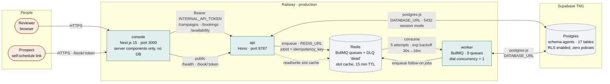
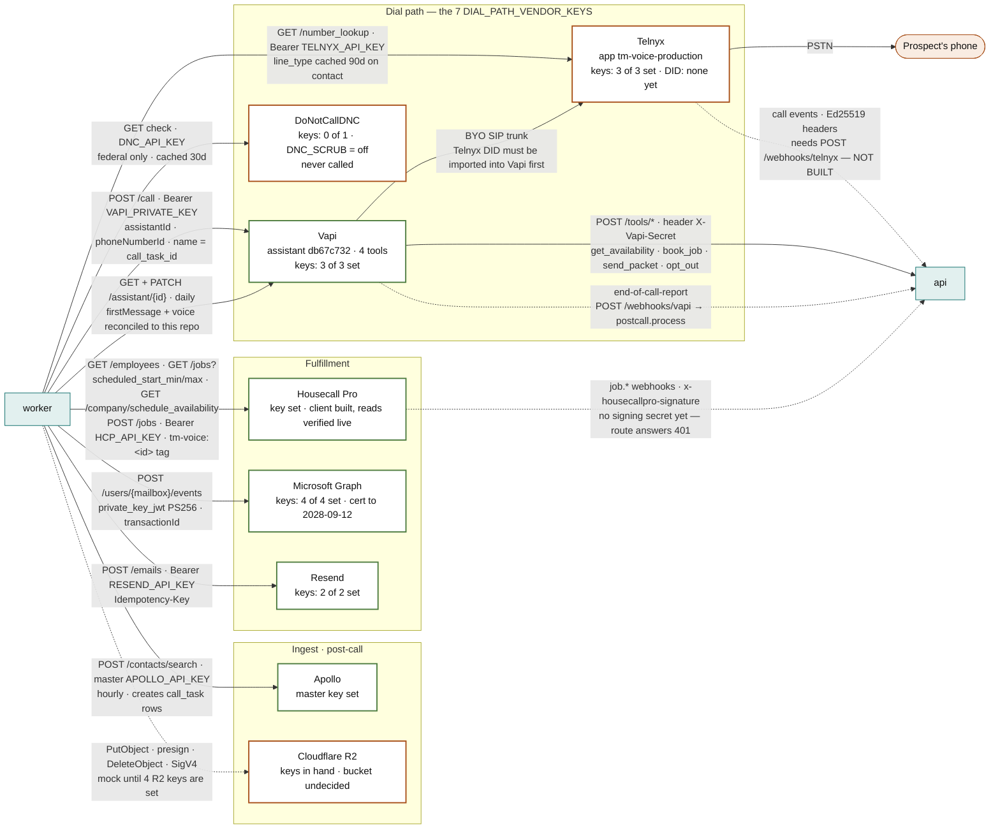
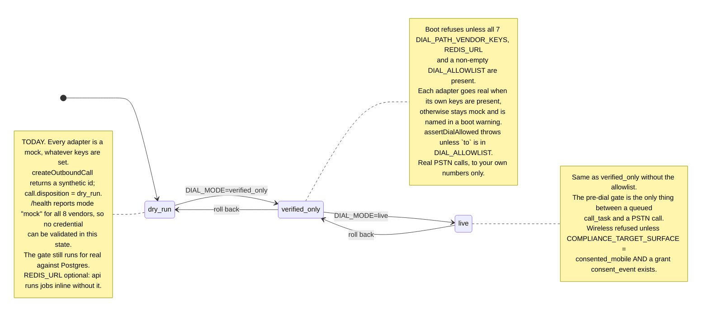
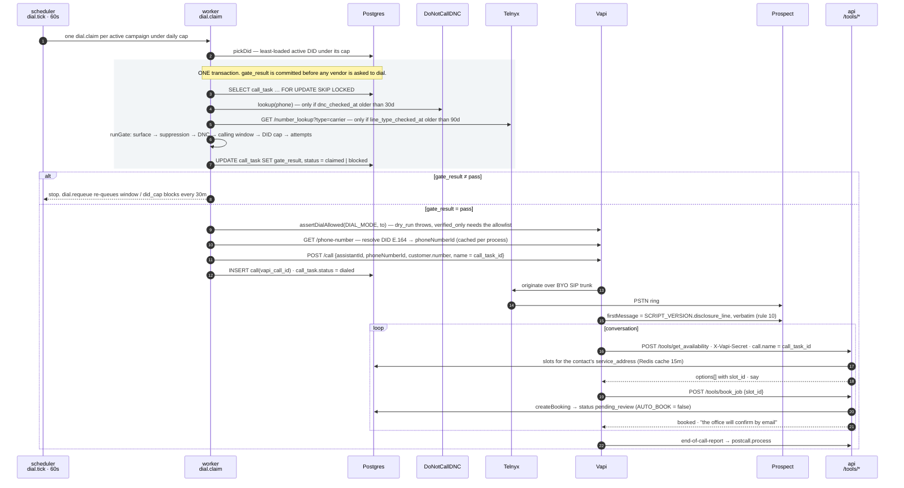
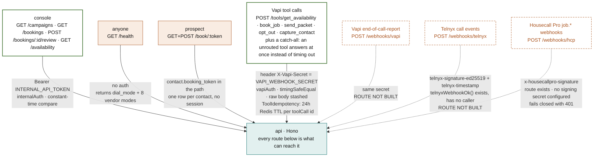
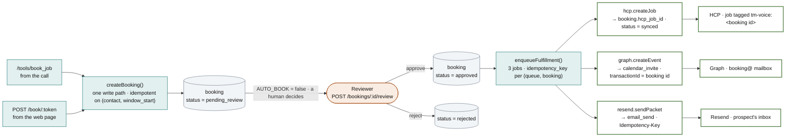
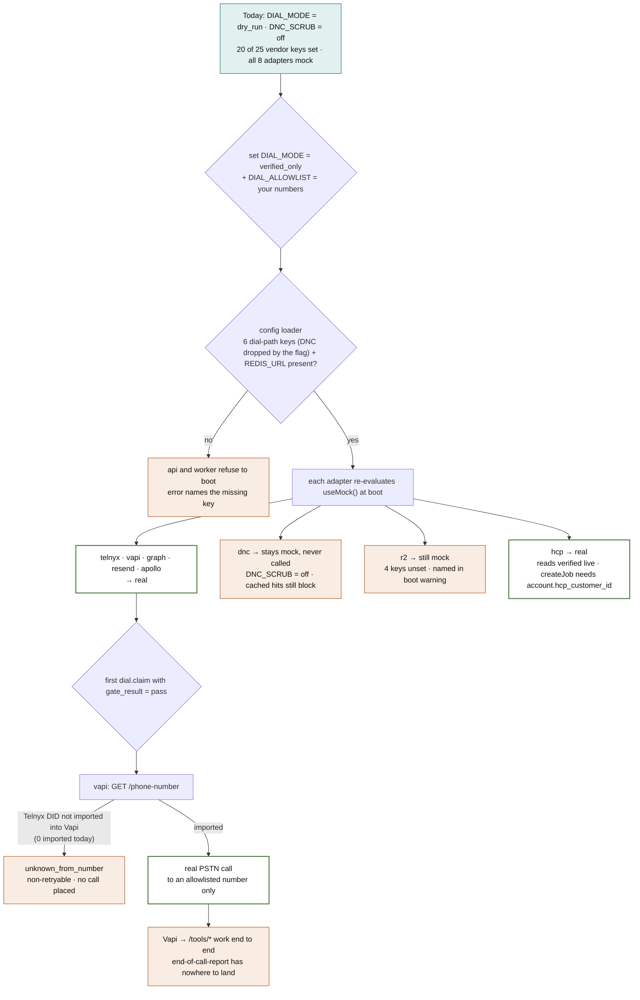

# Architecture — TM Voice

Autonomous outbound voice agent for Transparent Maintenance. Companions: `docs/ERD.md` (schema), `docs/COMPLIANCE.md` (pre-dial rules), `docs/RUNBOOK.md` (go-live sequence), `docs/CREDENTIALS.md` (where every credential comes from and how to rotate it).

This document answers four questions, in order: **what is connected**, **in what way**, **what has to be true for it to run that way**, and **what changes when the dial mode flips**. Every diagram is drawn from the code as it stands on `main` (2026-09-13), not from the build plan. Where the two disagree, the diagram says so.

How to read the diagrams:

| Mark | Meaning |
|---|---|
| Solid arrow `──▶` | Built, and runs for real once its keys are present |
| Dashed arrow `- - ▶` | Built as a mock only, or **not built** — the label says which |
| Green outline | Every key set, real client implemented |
| Amber outline | Keys partly set, or a prerequisite outside this repo is missing |
| Amber dashed outline | A gap in this repo's code |

---

## 1. Runtime topology — what runs where

Three Railway services, one Redis, one Postgres. The console never touches the database; everything it shows comes through the api with a bearer token.



**What has to be true for this to run:**

| Requirement | Where it is enforced | What happens if it is not met |
|---|---|---|
| `DATABASE_URL`, `INTERNAL_API_TOKEN` (≥16 chars) | `packages/shared/src/config.ts`, zod, at boot | Process exits with the missing name. Nothing partial starts. |
| `REDIS_URL` | Required by the **worker** unconditionally; required by the **api** only outside `dry_run` | Worker throws at boot. In `dry_run` the api falls back to an inline producer that runs jobs in-process — fine for tests, a footgun in production because there is no retry, no DLQ, and no scheduler. |
| The `agents` schema is migrated | `pnpm db:migrate` (drizzle, `postgres-js`) — never `drizzle-kit push`, which would diff TM1's other schemas | A missing column fails the first query that touches it, e.g. `technician.email` in `slots.ts`. This has happened once. |
| Session-mode Postgres (port 5432) | `packages/db/src/client.ts` sets `prepare: false`, so the transaction pooler (6543) *works* for queries, but the drizzle **migrator** needs session mode | Migrations fail with prepared-statement errors on 6543. Supabase's direct host (`db.<ref>.supabase.co`) is IPv6-first; if it does not resolve from Railway, use the session pooler on 5432. |
| `HOSTNAME=0.0.0.0` in the console image | `apps/console/Dockerfile` | Next standalone binds to the container id and Railway returns 502 while reporting the deploy as SUCCESS. Fixed, but worth knowing why the line is there. |

---

## 2. Vendor connections — what talks to whom, and with what

Every vendor call goes through one adapter in `packages/adapters/<vendor>` (rule 1). Each adapter decides at boot whether it is `real` or `mock`: **mock if `DIAL_MODE=dry_run`, or if any of its own keys is absent.** The label on each edge names the protocol, the credential, and the idempotency mechanism.



**Per-vendor detail** — the wire format each real client speaks, the keys that flip it real, and the one constraint that will bite if forgotten:

| Vendor | Goes `real` when all of these are set | Real client speaks | Idempotency | The constraint worth knowing |
|---|---|---|---|---|
| **telnyx** | `TELNYX_API_KEY` `TELNYX_CONNECTION_ID` `TELNYX_PUBLIC_KEY` | `GET /v2/number_lookup/{n}?type=carrier` · `POST /v2/calls` · Ed25519 verify over `timestamp\|rawBody` | `command_id = call_task_id`: Telnyx drops a repeated id, so a retried job cannot double-dial | `carrier.type` maps to `landline` **only** for `fixed line`. `fixed line or mobile`, toll-free and anything unrecognised become `unknown`, which `landline_only` refuses. All three keys are required *together* because the mock resolves most numbers to `landline` — a partial config would fail open. |
| **vapi** | `VAPI_PRIVATE_KEY` `VAPI_WEBHOOK_SECRET` `VAPI_ASSISTANT_ID` | `POST /call` · `GET /call/{id}` · `GET /phone-number` · `GET /assistant/{id}` · `PATCH /assistant/{id}` | The job envelope's key; Vapi has none. The assistant sync is idempotent by diff instead: it reads the live object and PATCHes only the fields that drifted | Vapi addresses caller ID by **`phoneNumberId`**, not E.164, so the Telnyx DID must first be **imported into Vapi** as a BYO number. `resolvePhoneNumberId` throws `unknown_from_number` otherwise — non-retryable, no call placed. The call object has no metadata field; the correlation id rides in `name` (40-char cap). |
| **dnc** | `DNC_API_KEY` | `GET /api/v1/check-1/` | n/a (read) | US-only — a non-`+1` number is refused, not reported clean. Returns a **federal** determination only; `state` is always `false`. State scrubbing is an open compliance gap. |
| **graph** | `MS_TENANT_ID` `MS_CLIENT_ID` `MS_CLIENT_CERT_PEM` `MS_BOOKING_MAILBOX` | client-credential token, then `POST /users/{mailbox}/events` | Graph `transactionId = booking id` | `private_key_jwt` with PS256 and `x5t#S256`, so the PEM must hold **both** the `CERTIFICATE` and `PRIVATE KEY` blocks; `\n`-escaped form accepted because Railway cannot store newlines. Cert expires **2028-09-12**; nothing in this system watches for that. |
| **resend** | `RESEND_API_KEY` `MAIL_FROM` | `POST /emails` | `Idempotency-Key` header, 24h, ≤256 chars | One `email_send` row per (booking, template); a re-run finds `status=sent` and stops before the vendor. |
| **apollo** | `APOLLO_API_KEY` | `POST /contacts/search` · `POST /phone_calls` · `PATCH /accounts/{id}` | Job envelope only — Apollo offers no idempotency header | All three endpoints need a **master** key. `/phone_calls` takes its params as a **query string**, not a body. Saved searches are addressed as `contact_label_ids` and must be contact-modality lists. |
| **r2** | `R2_ACCOUNT_ID` `R2_ACCESS_KEY_ID` `R2_SECRET_ACCESS_KEY` `R2_BUCKET` | S3 `PutObject` / presigned `GetObject` / `DeleteObject` | Object key | The only client not using `request()`: SigV4 needs `@aws-sdk/client-s3`, pinned to the fetch handler. Presigned URLs cap at 7 days. Recordings need their **own bucket** — see `docs/CREDENTIALS.md` § storage. |
| **hcp** | `HCP_API_KEY` | `GET /employees` · `GET /jobs?scheduled_start_min&scheduled_start_max` · `GET /company/schedule_availability` · `POST /jobs`, all paged at 200 | `tm-voice:<booking id>` **tag** on the job; before creating, the client scans ±1 day around `scheduled_start` for a job already carrying it | Every read shape was taken from the live API, not docs — envelope `{page, page_size, total_pages, total_items, <collection>}`, `schedule.{scheduled_start, scheduled_end, arrival_window}`, `assigned_employees[].id`, `address.{latitude, longitude}`. Canceled (`work_status` *pro canceled*, `canceled_at`) and deleted jobs are dropped so they never block a technician. `POST /jobs` mirrors those field names and **cannot be verified without creating a job in the production field system**; a wrong field fails as a vendor 4xx, never silently. Every job needs a `customer_id` — no `account.hcp_customer_id`, no job. Webhook verification has no signing secret yet, so `/webhooks/hcp` fails closed (401) and the 15-minute materializer carries freshness. |

---

## 3. Dial modes — the one switch that changes everything

`DIAL_MODE` is enforced in the telnyx and vapi **adapters**, not in the UI or the orchestrator (rule 5). The config loader gates the transitions; `assertDialAllowed()` gates each individual call.



The seven dial-path keys are `TELNYX_API_KEY`, `TELNYX_CONNECTION_ID`, `TELNYX_PUBLIC_KEY`, `VAPI_PRIVATE_KEY`, `VAPI_WEBHOOK_SECRET`, `VAPI_ASSISTANT_ID`, `DNC_API_KEY`. Requiring only these — not all 25 — means a first test call does not depend on a Graph certificate or a Resend domain. **`DNC_SCRUB=off` drops `DNC_API_KEY` from that set** (`requiredDialPathKeys()`): the gate then makes no registry lookup, but a hit already cached on a contact still blocks. It is a compliance decision — see `docs/COMPLIANCE.md` — and is logged at boot, reported by `/health` as `dnc_scrub`, and shown as a red pill on the console. Deepgram, ElevenLabs and the LLM are deliberately **not** in the list: nothing on the dial path calls them; those keys live inside Vapi's own Provider Keys. The one exception is `ELEVENLABS_VOICE_ID`, which `vapi.syncAssistant` reads to name the voice it applies (§9.1) — that job runs on its own schedule, off the dial path, so a missing value stops the sync and logs, and never blocks a call.

---

## 4. One dial, end to end — in what way things are connected

The sequence below is a single `dial.claim` job. The grey box is one Postgres transaction: **`gate_result` is committed before any vendor is asked to dial** (rule 3), and a vendor lookup failure inside it rolls the whole thing back, leaving the task `queued` for retry rather than writing it off as `blocked`.



Three things in that sequence are load-bearing and easy to miss:

1. **The gate runs six checks in a fixed order, first failure wins**: surface (line type × consent, plus the MA two-party-recording exclusion) → suppression → DNC → calling window → per-DID daily cap → attempt cap. It is a pure function (`runGate`) with no I/O, so every branch is unit-tested; `gateAndClaim` is the thin I/O wrapper around it.
2. **`call_task` rows have to exist before any of this fires.** `apollo.syncCampaign` (hourly) creates them from a campaign's saved search, one per (campaign, contact), enforced by a unique index. No campaign with `apollo_saved_search_id` set and `status='active'` ⇒ the dialer idles forever with nothing to claim and no error.
3. **The disclosure line is enforced by configuration, not at runtime.** Vapi's `firstMessage` is set to `SCRIPT_VERSION.disclosure_line` byte-for-byte, and the system prompt forbids re-introduction. `assertFirstUtterance()` exists in `packages/compliance` but **has no caller** — the runtime check belongs in the post-call pipeline (Phase 5) once transcripts arrive.

---

## 5. What can reach the api — every inbound surface and how it is authenticated



`/health` is public on purpose — it exposes mode, not secrets — and is what the console dashboard and Railway's healthcheck both read. `/tools/*` is the only surface a third party can drive; its secret is a value **we generate** and hand to Vapi, not one Vapi issues (`docs/CREDENTIALS.md`).

---

## 6. Booking → fulfillment — the write path after a "yes"

There is exactly one way a booking gets created (`createBooking()`), whether the prospect says yes on the phone or clicks a slot on `/book/:token`. `AUTO_BOOK` is settled `false`, so every booking waits for a human before anything reaches Housecall Pro, the calendar or the prospect's inbox.



The **slot handle is stateless**: `slot_id` is a 10-char hash of (technician, window_start). `book_job` recomputes the slots and matches, so a stale id from an earlier `get_availability` simply stops matching and the caller is offered what is still free — no slot table, no locks, no cleanup.

---

## 7. What changes when you leave `dry_run` — the honest version

This is the section to read before flipping the switch. It is drawn from `useMock()`, the config loader, and what each adapter does in `real` mode today.



**The change, item by item.** What flips automatically, what breaks, and what has to exist first:

| | Today (`dry_run`) | After the flip | Required first |
|---|---|---|---|
| **Config** | 20/25 keys set; loader accepts anything | Loader **refuses to boot** without the dial-path keys + `REDIS_URL` (+ `DIAL_ALLOWLIST` for `verified_only`). With `DNC_SCRUB=off` that is **6** keys, all set | Nothing — every required key is present |
| **dnc** | mock, consulted on every claim | **never consulted** (`DNC_SCRUB=off`); cached hits still block; `warn` at boot; red pill on the console | A DoNotCallDNC block, when the decision is reversed: set the key and `DNC_SCRUB=required` |
| **telnyx / vapi** | mock | real | A **DID** purchased on Telnyx, **imported into Vapi** as a BYO number, with a matching `did` row — three separate steps, none of them a key |
| **graph / resend / apollo** | mock | real | Nothing further |
| **r2** | mock | still mock, named in the boot warning | 4 keys (in hand) and a bucket decision (`tm-call-recordings`, not `tm-os-1`) |
| **hcp** | mock — returns the seed fixture | real: `materialize` pulls the 8 real technicians, their jobs and the company windows every 15 min; `createJob` writes back after approval | `account.hcp_customer_id` on the account being booked — without it `createJob` refuses with `customer_required` rather than guessing a customer |
| **`/health`** | `mock` for all 8, `ok:true` regardless | Per-vendor truth; a bad credential finally shows as `ok:false` | — |
| **Telnyx call events** | nothing arrives | Telnyx POSTs to `/webhooks/telnyx` and gets **404** | The route — `telnyxWebhookOk()` is written and untested against a caller |
| **Vapi end-of-call-report** | disposition, duration, cost, transcript, task retry written by `postcall.process` (2026-09-13) | recording to R2 and `apollo.logCall` still missing | R2 bucket decision; Apollo plan with call logging |
| **Disclosure line** | enforced by Vapi config, checked on every transcript by `postcall.process` | — | — |
| **Database rows** | seed fixture only | same rows drive real calls | `script_version` (active), `did`, `campaign` with `apollo_saved_search_id` + `status='active'`. `pnpm db:seed` has never run against TM1 |

Every row in this table is now a *missing thing* rather than a regression: the HCP client that used to turn `real` mode into a 15-minute failure loop is written and its reads are verified against the live account. The remaining code gaps — the two webhook routes and the Phase 5 post-call pipeline — degrade nothing that works today.

---

## 8. Data ownership — which component writes which table

`docs/ERD.md` is generated from the schema and CI fails if the two drift. This is the ownership view: 17 tables in the `agents` schema, RLS enabled with **no policies** — intentionally. The api and worker connect as the table owner, which bypasses RLS; `anon`, `authenticated`, `service_role` and `authenticator` hold no `USAGE` on the schema and no privilege on any table (verified, not assumed). Do not add a `service_role` policy: it would *grant* access that does not exist today.

| Feature | Components | Owns tables |
|---|---|---|
| Campaign & dial | worker `dial.tick` / `dial.claim` / `dial.requeue`, compliance gate, telnyx + vapi adapters | `campaign`, `call_task`, `call`, `did`, `script_version` |
| Compliance | `packages/compliance`, dnc adapter, `/tools/opt_out` | `consent_event` (append-only), `suppression` (unique on `phone_e164`, never keyed on contact) |
| Availability & booking | api availability service, booking routes, console `/book`, hcp adapter | `technician`, `schedule_block`, `service_address`, `booking` |
| Fulfillment | worker `hcp.createJob` / `graph.createEvent` / `resend.sendPacket`, reviewer | `calendar_invite`, `email_send` |
| Post-call (Phase 5) | worker `postcall.process` (stub), r2 adapter, `retention.sweep` | `recording` (`retain_until` ≥ 5y, DB check constraint), `transcript` |
| CRM sync | apollo adapter, `apollo.syncCampaign` | `account`, `contact` |

---

## 9. Patterns — the only shapes allowed

Before adding a component, extend one of these. Two components solving the same problem differently is a finding.

| Pattern | Shape | Used by |
|---|---|---|
| Adapter | `{ name, mode, healthcheck() }` + typed methods; zod input; `AdapterError{vendor,code,retryable}`; `withRetry`; mock when a key is absent or `DIAL_MODE=dry_run` | all 8 vendors |
| Vendor HTTP call | `request()` in `packages/adapters/src/base.ts`: query building, JSON encode/decode, 15s timeout, status → `AdapterError` (408/425/429/5xx and transport errors retryable), wrapped in `withRetry` | every real client except r2, which signs via the S3 SDK |
| Job envelope | `{ entity_id, idempotency_key, attempt, enqueued_at }`; BullMQ `jobId = idempotency_key`; one retry policy (5 attempts, exponential from 30s); one DLQ (`dead`); `pnpm replay <queue> <job_id>` | every queue |
| Processor registry | `REGISTRY[queue][jobName] → (ctx, payload)` in `apps/worker/src/registry.ts`, plus `SCHEDULES` for repeatables | every worker job |
| Gate-then-act | `gateAndClaim()` writes `gate_result` in the claiming transaction; only `pass` reaches an adapter | dial orchestrator |
| Materialize + invalidate | pull vendor state into a table on a schedule + webhook; serve from Redis with a 15-minute TTL | `schedule_block` / slots |
| Token-per-contact public page | `contact.booking_token` → `/book/:token` | booking page |
| One booking write path | `createBooking()` in `apps/api/src/booking-core.ts`, idempotent on (contact, window_start) | `/book/:token` and `book_job` |
| Stateless slot handle | `slot_id` = short hash of (technician, window_start); recomputed on `book_job` | `get_availability` → `book_job` |
| Idempotent write | unique `idempotency_key` column + `onConflictDoNothing` | `booking`, `email_send` |
| Say it out loud | data a TTS voice has to read is rendered for the ear, not the eye: spelled out, punctuation named, digits as words | `sayEmail` / `sayPhone` in `packages/shared/src/speech.ts` |
| Checked-in vendor state | desired state is a reviewed constant in this repo; a scheduled job reads the live object, diffs the fields it owns, and PATCHes only on drift | `vapi.syncAssistant` |

Worker schedules registered at boot: `dial.tick` 60s · `dial.requeue` 30m · `availability.materialize` 15m · `apollo.syncCampaign` 60m · `retention.sweep` 24h · `vapi.syncAssistant` 24h. Concurrency is 1 on `dial`, 4 everywhere else.

### 9.1 The assistant's voice, script and call handling

Joe is an ElevenLabs voice rendered by Vapi. His tuning used to exist only in the Vapi dashboard, which meant a change to how the agent sounds to a prospect produced no diff and no review. It now lives in `packages/adapters/src/vapi/voice.ts`, and `vapi.syncAssistant` reconciles assistant `VAPI_ASSISTANT_ID` against it once a day.

**The owned surface grew on 2026-09-17,** after seven pieces of feedback from a real call. Six of the seven traced to the system prompt or to a Vapi call-handling setting — the agent talking over the caller, re-pitching three turns in a row, reading an email address back unintelligibly, sitting silent for half a minute, hanging up mid-sentence, and an ambient office-noise loop nobody had chosen. All of that lived on exactly the surface the split called "dashboard territory", which is to say the surface with no diff, no review and no CI. An agent that hangs up on a prospect is not a dashboard preference.

So the job now owns four things:

| Field | Source of truth | Why it is owned |
|---|---|---|
| `firstMessage` | active `SCRIPT_VERSION.disclosure_line`, verbatim | Rule 10, enforced by a running job rather than by convention |
| `voice` | `packages/adapters/src/vapi/voice.ts` | How Joe sounds is a code review |
| `model.messages[0]` (the system prompt) | `packages/adapters/src/vapi/conversation.ts` | How Joe behaves is a code review, for the same reason |
| `backgroundSound` + the speech plan | `conversation.ts` | Turn-taking and ambience decide whether a call is usable at all |

It still stops short of the model choice, the transcriber and the tool wiring. `updateAssistant` **reads** the live assistant and replaces only `model.messages`, because Vapi replaces a nested object wholesale on PATCH and sending a freshly built `model` would silently drop the assistant's tools. Which LLM it runs and which tools it can call stay dashboard decisions.

`voiceId` is not in this file: which voice Joe *is* stays in `ELEVENLABS_VOICE_ID`, so swapping voices is a config change, while how he *sounds* is a code review.

**Every rule in `conversation.ts` traces to a specific failed call**, which is why it reads as rules rather than suggestions — each one fixes the model doing something reasonable-sounding that made the call worse. The objective is deliberately narrow: find out who approves maintenance vendors and how to reach them. A scripted agent cannot hold an open-ended conversation about maintenance contracts, and trying is what produced the re-pitching.

### 9.2 Saying data out loud

`sayEmail` / `sayPhone` / `spellOut` in `packages/shared/src/speech.ts` exist because handing a raw email address to a TTS engine produces a fast run of syllables in which the parts a listener needs — where the dots are, hyphen versus underscore — are exactly the parts that get swallowed. Addresses are therefore said once whole and then spelled, punctuation named in words, digits as words so "0" cannot be written down as "O", commas between every character so the voice pauses instead of sprinting. `capture_contact` and `send_packet` both read back through it.

`pnpm voice:check` fails CI when this block drifts from the profile or when the profile is a shape ElevenLabs would not honour. `pnpm voice:write` regenerates it.

<!-- voice:generated -->
```
# Joe's ElevenLabs voice, as applied to VAPI_ASSISTANT_ID by the vapi.syncAssistant job.
# Generated from packages/adapters/src/vapi/voice.ts; do not hand-edit. Run: pnpm voice:write
  model           eleven_flash_v2_5 ElevenLabs model. V2-or-newer is required for `style` to have any effect
  stability       0.3               0–1. Lower is more expressive; high stability flattens prosody into a monotone
  similarityBoost 0.75              0–1. Adherence to the source recording. Raising it re-flattens delivery
  style           0.4               0–1. Style exaggeration. 0 is the flat read; higher costs some latency
  useSpeakerBoost true              Keeps the speaker's timbre while the settings above loosen up
  speed           1.07              0.7–1.2. Below 1.0 reads as downbeat
```
<!-- /voice:generated -->

A note on `style`: it is ignored outside V2-class models, and the failure is silent — the PATCH succeeds, the dashboard shows the value, and the call still sounds flat. The check refuses that combination rather than letting it ship.

---

## 10. Status — one row per component, as of 2026-09-13

| Layer | Component | Where | State |
|---|---|---|---|
| Front-end | Campaign console (dashboard) | `apps/console/app/page.tsx` | **Deployed.** Reads `/health`, `/campaigns`, pending `/bookings`. Review and Live pages are placeholders (Phases 4/6) |
| Front-end | Self-schedule page `/book/[token]` | `apps/console/app/book` | **Deployed.** Calls the public booking routes |
| Middleware | Tool API `/tools/*` | `apps/api/src/routes/tools.ts` | **Built and wired**: 4 Vapi function tools point at it with the shared secret |
| Middleware | Booking API, review, availability, health | `apps/api/src/routes/*` | **Built** |
| Middleware | Webhooks | `apps/api/src/routes/webhooks.ts` | `/hcp` exists and fails closed until a signing secret is configured; **`/telnyx` and `/vapi` do not exist** |
| Middleware | Dial orchestrator, campaign ingest, requeue, fulfillment | `apps/worker/src/processors` | **Built.** `apollo.logCall` is a stub; `postcall.process` writes results but not recordings |
| Middleware | Pre-dial gate, suppression, consent ledger, calling windows | `packages/compliance` | **Built.** `assertFirstUtterance` has no caller |
| Middleware | Vendor adapters | `packages/adapters` | **8 of 8 real clients written.** hcp reads verified live; `POST /jobs` body mirrors HCP's own field names, unverified until the first real approval |
| Middleware | Config loader, logger, errors, job envelope | `packages/shared` | **Built.** Blank Railway variables read as unset |
| Back-end | Postgres schema, 4 migrations, seed | `packages/db` | **Migrated on TM1.** Seed never run against it |
| Back-end | Redis | Railway plugin | **Running** |
| Infra | Railway (api, worker, console) | `apps/*/Dockerfile` | **Deployed**, `api-production-d51a` / `console-production-e58c` |
| Infra | CI | `.github/workflows/ci.yml` | typecheck · lint · **183 tests** · ERD check · build, on push to `main` and every PR |
| Vendor | Vapi | — | Assistant `db67c732` *TM Voice - Atlanta PM v1*, 4 tools. Voice and opening line now reconciled from this repo by `vapi.syncAssistant` (§9.1); the profile has **not** yet been applied to the live assistant. **0 phone numbers imported** |
| Vendor | Telnyx | — | App `tm-voice-production` (`3047698443645487069`), API v2, Call Cost on. **0 DIDs, balance $5, KYC pending** |
| Vendor | Microsoft Graph | — | Certificate set and uploaded to Entra; expires 2028-09-12 |
| Vendor | Housecall Pro | — | Client built. 8 employees, company windows Mon–Fri 08:00–16:00, jobs paged at 200. Webhook signing secret not yet configured |
| Vendor | Cloudflare R2 | — | Keys minted; bucket and account ownership open (`docs/CREDENTIALS.md`) |
| Vendor | DoNotCallDNC | — | No key; **bypassed by `DNC_SCRUB=off`** (compliance decision, `docs/COMPLIANCE.md`). No dial-path key remains unset |
