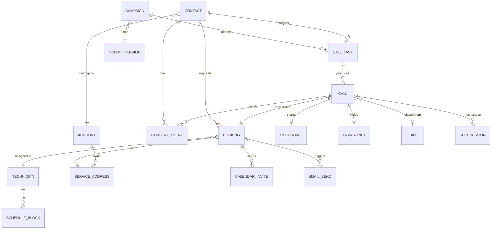

# ERD — TM Voice

Source of truth is `packages/db/src/schema.ts`. The diagram is hand-maintained from the artifact "Data Model" tab; the column block at the bottom is **generated** (`pnpm erd:write`) and CI fails when it drifts from the schema (`pnpm erd:check`).

## Rules (build plan §4)

- External vendor IDs (`apollo_contact_id`, `hcp_job_id`, `graph_event_id`, …) are plain nullable columns, never the primary key.
- `consent_event` is append-only: trigger `consent_event_immutable_trg` rejects UPDATE and DELETE (`packages/db/migrations/0001_consent_immutable.sql`).
- `suppression.phone_e164` is UNIQUE; suppression keys on number, not contact.
- `schedule_block` is materialized from HCP jobs + PTO + windows; invalidated by webhook and every 15 min.
- `call_task.gate_result` is written in the same transaction that claims the task (`packages/compliance/src/gate.ts`).
- `recording.retain_until` = created + 5 years, enforced by check constraint `recording_retain_5y`; the retention sweeper never deletes earlier.

## Diagram



Departures from the artifact diagram, both additive: `campaign.script_version_id` and `campaign.apollo_saved_search_id` carry the drawn relationships as real columns; `booking.contact_id` exists because the self-schedule page creates bookings with no `call`.

## Tables and columns (generated)

<!-- erd:generated -->
```
# table.column  type  [PK|FK->table|UK|NOT NULL]  — generated from packages/db/src/schema.ts; do not hand-edit
account
  id  uuid  [PK]
  name  text  [NOT NULL]
  type  account_type  [NOT NULL]
  apollo_account_id  text
  hcp_customer_id  text
  created_at  timestamp with time zone  [NOT NULL]
  updated_at  timestamp with time zone  [NOT NULL]
contact
  id  uuid  [PK]
  account_id  uuid  [FK->account.id NOT NULL]
  first_name  text
  last_name  text
  email  text
  phone_e164  text  [NOT NULL]
  line_type  line_type  [NOT NULL]
  state  text
  timezone  text  [NOT NULL]
  apollo_contact_id  text
  dnc_federal  boolean  [NOT NULL]
  dnc_state  boolean  [NOT NULL]
  dnc_checked_at  timestamp with time zone
  line_type_checked_at  timestamp with time zone
  booking_token  text  [UK NOT NULL]
  created_at  timestamp with time zone  [NOT NULL]
  updated_at  timestamp with time zone  [NOT NULL]
service_address
  id  uuid  [PK]
  account_id  uuid  [FK->account.id NOT NULL]
  line1  text  [NOT NULL]
  line2  text
  city  text
  state  text
  zip  text
  lat  numeric(9, 6)
  lon  numeric(9, 6)
  hcp_address_id  text
  created_at  timestamp with time zone  [NOT NULL]
  updated_at  timestamp with time zone  [NOT NULL]
script_version
  id  uuid  [PK]
  name  text  [NOT NULL]
  disclosure_line  text  [NOT NULL]
  body  text  [NOT NULL]
  active  boolean  [NOT NULL]
  created_at  timestamp with time zone  [NOT NULL]
  updated_at  timestamp with time zone  [NOT NULL]
campaign
  id  uuid  [PK]
  name  text  [NOT NULL]
  script_version_id  uuid  [FK->script_version.id NOT NULL]
  apollo_saved_search_id  text
  daily_dial_cap  integer  [NOT NULL]
  max_attempts  integer  [NOT NULL]
  status  campaign_status  [NOT NULL]
  created_at  timestamp with time zone  [NOT NULL]
  updated_at  timestamp with time zone  [NOT NULL]
call_task
  id  uuid  [PK]
  campaign_id  uuid  [FK->campaign.id UK NOT NULL]
  contact_id  uuid  [FK->contact.id UK NOT NULL]
  earliest_dial_at  timestamp with time zone  [NOT NULL]
  attempt_no  integer  [NOT NULL]
  status  call_task_status  [NOT NULL]
  gate_result  gate_result
  claimed_at  timestamp with time zone
  created_at  timestamp with time zone  [NOT NULL]
  updated_at  timestamp with time zone  [NOT NULL]
did
  id  uuid  [PK]
  phone_e164  text  [UK NOT NULL]
  attestation  text  [NOT NULL]
  daily_cap  integer  [NOT NULL]
  label_status  text  [NOT NULL]
  telnyx_number_id  text
  active  boolean  [NOT NULL]
  created_at  timestamp with time zone  [NOT NULL]
  updated_at  timestamp with time zone  [NOT NULL]
call
  id  uuid  [PK]
  call_task_id  uuid  [FK->call_task.id NOT NULL]
  did_id  uuid  [FK->did.id]
  started_at  timestamp with time zone  [NOT NULL]
  ended_at  timestamp with time zone
  duration_sec  integer  [NOT NULL]
  disposition  disposition
  apollo_phone_call_id  text
  vapi_call_id  text
  telnyx_call_control_id  text
  cost_usd  numeric(8, 4)  [NOT NULL]
  created_at  timestamp with time zone  [NOT NULL]
  updated_at  timestamp with time zone  [NOT NULL]
recording
  id  uuid  [PK]
  call_id  uuid  [FK->call.id NOT NULL]
  r2_key  text  [NOT NULL]
  signed_url  text
  signed_url_expires_at  timestamp with time zone
  retain_until  date  [NOT NULL]
  created_at  timestamp with time zone  [NOT NULL]
  updated_at  timestamp with time zone  [NOT NULL]
transcript
  id  uuid  [PK]
  call_id  uuid  [FK->call.id NOT NULL]
  turns  jsonb  [NOT NULL]
  summary  text
  created_at  timestamp with time zone  [NOT NULL]
  updated_at  timestamp with time zone  [NOT NULL]
consent_event
  id  uuid  [PK]
  contact_id  uuid  [FK->contact.id NOT NULL]
  call_id  uuid  [FK->call.id]
  event_type  consent_event_type  [NOT NULL]
  channel  text  [NOT NULL]
  capture_artifact  jsonb  [NOT NULL]
  occurred_at  timestamp with time zone  [NOT NULL]
  created_at  timestamp with time zone  [NOT NULL]
suppression
  id  uuid  [PK]
  phone_e164  text  [UK NOT NULL]
  reason  text  [NOT NULL]
  source_call_id  uuid  [FK->call.id]
  created_at  timestamp with time zone  [NOT NULL]
technician
  id  uuid  [PK]
  name  text  [NOT NULL]
  hcp_employee_id  text
  max_jobs_per_day  integer  [NOT NULL]
  max_miles_between_jobs  integer  [NOT NULL]
  home_lat  numeric(9, 6)
  home_lon  numeric(9, 6)
  active  boolean  [NOT NULL]
  created_at  timestamp with time zone  [NOT NULL]
  updated_at  timestamp with time zone  [NOT NULL]
schedule_block
  id  uuid  [PK]
  technician_id  uuid  [FK->technician.id NOT NULL]
  start_at  timestamp with time zone  [NOT NULL]
  end_at  timestamp with time zone  [NOT NULL]
  source  schedule_block_source  [NOT NULL]
  hcp_job_id  text
  lat  numeric(9, 6)
  lon  numeric(9, 6)
  created_at  timestamp with time zone  [NOT NULL]
  updated_at  timestamp with time zone  [NOT NULL]
booking
  id  uuid  [PK]
  call_id  uuid  [FK->call.id]
  contact_id  uuid  [FK->contact.id NOT NULL]
  technician_id  uuid  [FK->technician.id NOT NULL]
  service_address_id  uuid  [FK->service_address.id NOT NULL]
  window_start  timestamp with time zone  [NOT NULL]
  arrival_window_min  integer  [NOT NULL]
  hcp_job_id  text
  status  booking_status  [NOT NULL]
  idempotency_key  text  [UK NOT NULL]
  reviewed_by  text
  reviewed_at  timestamp with time zone
  created_at  timestamp with time zone  [NOT NULL]
  updated_at  timestamp with time zone  [NOT NULL]
calendar_invite
  id  uuid  [PK]
  booking_id  uuid  [FK->booking.id NOT NULL]
  graph_event_id  text
  rsvp_status  text  [NOT NULL]
  created_at  timestamp with time zone  [NOT NULL]
  updated_at  timestamp with time zone  [NOT NULL]
email_send
  id  uuid  [PK]
  booking_id  uuid  [FK->booking.id NOT NULL]
  template  text  [NOT NULL]
  provider_message_id  text
  status  text  [NOT NULL]
  idempotency_key  text  [UK NOT NULL]
  created_at  timestamp with time zone  [NOT NULL]
  updated_at  timestamp with time zone  [NOT NULL]
```
<!-- /erd:generated -->
